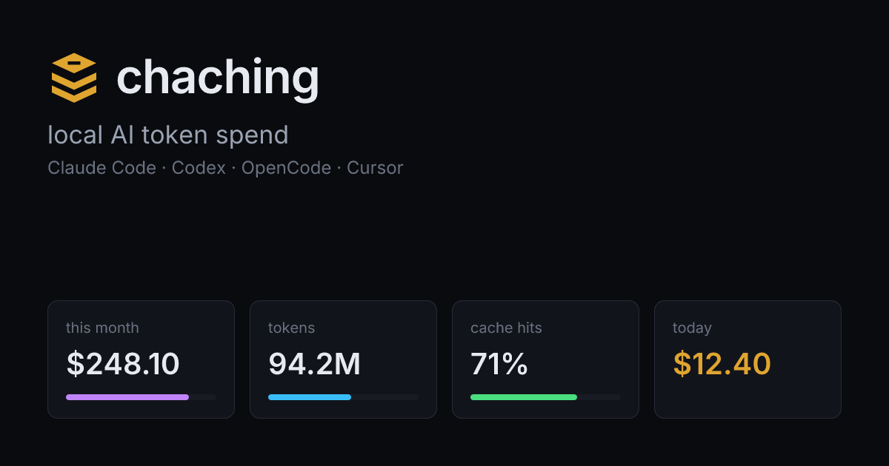

<p align="center">
  
</p>

<p align="center"><strong><em>cha-ching.</em> it counts the cache hits too.</strong></p>

<p align="center">
  <a href="https://www.npmjs.com/package/chaching"></a>
  
  <a href="LICENSE"></a>
  
  
</p>

<p align="center">
  
</p>

A local cash register for the money your coding agents are quietly setting on fire.

chaching watches what Claude Code, Codex, OpenCode, and Cursor actually spend, reads it straight off your own machine, and rings it up: a live terminal dashboard, a browsable web view, a one-shot summary, and a shareable receipt. No cloud. No account. No telemetry. The only thing it phones is your conscience.

The name is two jokes wearing one coat: **cha-ching**, the sound of your balance leaving, and **caching**, the token-cache mechanics that quietly save you a fortune. chaching tallies both, so you see the damage *and* the discount.

<!-- TODO (follow-up): animated TUI asciinema cast of the live dashboard. -->

---

## Quick start

```sh
# zero-install, runs on your own data, deletes itself after
npx chaching

# pnpm / bun work too
pnpm dlx chaching
bunx chaching

# install it for real (recommended if you want history to accrue — see below)
npm i -g chaching
chaching
```

That's it. No signup, no API key (unless you want Cursor), no config file to write. First run drops you in a setup wizard, then opens the dashboard reading whatever AI tools you already use.

> **Node >= 24.16 is required**, and it's not negotiable. chaching stores history in a local SQLite database via Node's built-in `node:sqlite`, which landed in 24.16. Older Node will refuse to start. `node --version` to check; `nvm install 24` if you're behind.

---

## What you get

| Command | What it does |
|---|---|
| `chaching` | Always-on **TUI dashboard** — live, updates as your agents spend. |
| `chaching stats` | **One-shot summary** to stdout, then exits. Pipe-friendly. |
| `chaching receipt` | Your spend as a **branded thermal receipt**. Shareable. Mildly threatening. |
| `chaching serve` | The **web dashboard** — calendar heatmap, day-by-day browsing, session drill-down. |
| `chaching init` | Re-run the setup wizard. |
| `chaching provider …` | Enable / disable / add a provider without the wizard. |
| `chaching sync …` | Create or join a shared PostgreSQL pool and map subscriptions. |

Global flags: `--version`, `--help`, `--no-art` (kills the ASCII banner and the jokes, for when you're not in the mood or you're piping to something that is). `NO_COLOR` and `CHACHING_NO_ART` are both honoured.

---

## The commands, in detail

### `chaching` — the live register

The default. An interactive terminal dashboard that stays open and ticks up as your tools write new records.

```
  ◆ chaching                                        all ▾

  $9,633              13.49B tokens         top: Opus 4.8
  TOTAL BURN          in · out · cache        $9,324

  trend (by week)  ▁▂▃▂▄▅▆▇█▇▅▄▂▃     peak $2,140

  By provider                   By model
  ● Claude Code   $9,458         Opus 4.8     $9,324
  ● Codex           $164         Sonnet 4.6      $95
  ● OpenCode         $10         Haiku 4.5       $10

  5h block  ███████████░░░░░░░░░  $18.40 · 2h50m in · 2h10m left

  [d w m Q a] period   [1-9] toggle provider   [0] clear   [q] quit
```

*(Numbers illustrative. Your real ones are worse.)*

Keys: `d` `w` `m` `Q` `a` switch the window (day / week / month / quarter / all-time), `←` `→` step through it, `1`-`9` toggle providers, `0` clears the filter, `q` or `Ctrl-C` quits clean.

### `chaching stats` — one-shot, pipe-safe

Totals, per-provider and per-model breakdown, earliest covered date, then exits. Detects a non-TTY and falls back to plain text, so it's safe in scripts, CI logs, and `| pbcopy`.

```sh
chaching stats                  # all-time (default)
chaching stats --period week    # day | week | month | quarter | all
chaching stats --provider claude
chaching stats --json           # machine-readable snapshot
```

### `chaching receipt` — proof of purchase

The fun one. Renders a period's spend as a thermal-printer receipt: line items per model, the cache savings as **coupons** (the caching pun, made structural), the cache cost as **billed line items** right beneath them (because cache isn't free, see below), a `TOTAL BURN`, an optional subscription-subsidy footer, a wry footer, and a barcode that means nothing.

```sh
chaching receipt                         # this month (default) — this is going to sting
chaching receipt --period all            # all time
chaching receipt --png ~/burn.png        # export a shareable image
chaching receipt --json
```

The period is a **rolling window anchored at your latest day with data**, the same
window the dashboard hero uses, so `receipt --period month` always equals the
dashboard's "month" total. `month` = the last 30 days, `week` = the last 7, `day` =
the latest day, `quarter` = the last 90, `all` = your whole banked history. (The
SUBSCRIPTION SUBSIDY footer is the one exception — it stays on a calendar
month-to-date basis, because that is what reconciles against a monthly fee.)

```
------------------------------------------
    chaching — AI token spend register
  this month  ·  2026-05-25 → 2026-06-23
------------------------------------------
CLAUDE CODE
  Opus 4.8                          $9,141
  Sonnet 4.6                          $95
. . . . . . . . . . . . . . . . . . . . .
COUPONS — CACHE DISCOUNTS
  Opus 4.8 cache hit              -$56,035
YOU SAVED                         -$58,414

CACHE — BILLED, NOT FREE
  cache reads (billed)               $28
  cache writes (billed)              $11
------------------------------------------
TOTAL BURN                          $9,633
------------------------------------------
SUBSCRIPTION SUBSIDY
this month multiple                   97×
$9,633 value           for $99.00 fee
net subsidy                     +$9,534
------------------------------------------
        REF F993F9 · 2026-06-22
```

**Cache is billed, not free.** The "you saved" coupon is real, but it's a *discount*, not a freebie: cache reads are still charged at the cache-read rate (0.1× of fresh input), and cache writes at the cache-write rate (1.25× for 5-minute, 2× for 1-hour). The receipt and the dashboard now show both numbers, the savings AND the billed cost, so it's unmistakable that the cache costs money, just much less than re-sending the same tokens uncached. The `YOU SAVED` line is the delta versus paying full input price; the `CACHE — BILLED` lines are what the cache actually cost. Every rate is read from the same price map the rest of chaching uses, never a hardcoded constant. (The write line uses the base cache-write rate; where a model also has a separate 1-hour cache rate, the billed-writes figure is a slight underestimate of that component, never an overstatement, and `TOTAL BURN` is always exact regardless.)

**Shows your details by default, redaction is one flag away.** A receipt is your own local data, so by default it shows your real username, machine name, and file paths. When you want to share one, add `--redact` (CLI) or `?redact=1` (the web receipt) to scrub the username, hostname, and paths into redaction blocks first, so you can post it without doxxing yourself.

### `chaching serve` — the web dashboard

The browser view, for when a wall of terminal text isn't enough self-flagellation. Starts on port 5178.

```sh
chaching serve
# → http://0.0.0.0:5178
```

**Behind a reverse proxy.** Two knobs, because they're different things:

- **Public origin** (runtime): set `ORIGIN` (or `server.origin` in the config) to the externally-visible URL so absolute links are correct, e.g. `ORIGIN=https://chaching.example.com chaching serve`. `HOST` and `PORT` are honoured too.
- **Subpath / base path** (build time): to mount under a path like `https://example.com/chaching/`, build with `CHACHING_BASE_PATH` set — `CHACHING_BASE_PATH=/chaching pnpm build`, then `chaching serve`. SvelteKit bakes the base path into the bundle (there is no runtime base path), so this needs a build from source; the published npm package is built at the root. `serve` reflects the configured base/origin in the link it prints.

What's in there:

- **Calendar heatmap** over every day you've ever banked, shaded by spend. Click a cell (or arrow through days) to pin the whole dashboard to that day.
- **Session browser** — sortable, searchable, drill into any individual session to see what that one expensive afternoon actually cost.
- **Coverage-aware everything** — a dip reads as "today's not done yet," a gap reads as "no logs that far back," never a lying "$0". Comparisons only show when there's a real prior window to compare against, so you'll never see a deranged "+563% vs prior $0".

### `chaching init` / `chaching provider …`

```sh
chaching init                     # re-run the wizard any time
chaching provider enable cursor
chaching provider disable codex
chaching provider add opencode
```

The wizard shows a checklist of providers (all on by default), asks for any secret it needs (just Cursor's admin token), and writes `~/.config/chaching/config.json` at mode `0600`.

---

## Subsidisation: what your flat fee actually buys

Here's the number most people on Claude Code or Codex actually care about. You're not paying per token; you're on a flat plan (Pro, Max, Corporate, whatever). So the interesting question isn't "what did this cost", it's "how much API-priced value did my flat monthly fee just buy me". chaching already computes the API-equivalent burn for every provider. Point it at your subscription and it frames that burn against the fee:

> **97×** — $9,633 of API value for $99.

The dashboard shows a **Subscription subsidy** card (per-provider and combined) with the multiple, the net monthly subsidy, and a projected figure; the receipt grows a subsidy footer on `--period month` (and the all-time default). Both are month-based on purpose.

**It's calendar-month, month-to-date.** The headline compares the current calendar month *so far* against the *full* monthly fee, because that's the comparison that lines up with your card statement. Early in the month that number is honestly low (you've only banked a few days), so the card also shows a clearly-labelled **projected** multiple, `month-to-date burn ÷ fraction of the month elapsed`, for "if it keeps going like this, where does it land". The headline never dips mid-month; it only grows. The subsidy headline stays month-based even when you flip the dashboard to Day/Week, while the cache panel follows the period selector, because one is "what did my monthly fee buy me" and the other is "what did this window cost".

**Tiers.** Per provider you pick a plan from a switcher (or enter a Custom amount):

| Claude | Codex |
|--------|-------|
| Free $0 · Pro $20 · Max 5× $100 · Max 20× $200 · Team Premium $100 · Corporate $99 · Custom | Free $0 · Go $8 · Plus $20 · Pro 5× $100 · Pro 20× $200 · Corporate $99 · Custom |

The default for both is **Corporate $99** (so it does something sensible before you touch it). The switcher writes straight through to `~/.config/chaching/config.json` (atomically, mode `0600`) and the card recomputes live.

**Edge cases it handles honestly.** A **Free ($0)** tier has no fee to divide by, so the multiple reads **"∞ — all of it"** (every penny subsidised), never a divide-by-zero or a leaked `Infinity`. If your fee currently exceeds the value you've used (light month, or it's the 2nd), the card says **"under-using your plan"** with the real negative number, not a fake positive. Subsidisation applies only to Claude and Codex, the providers whose cost chaching computes; OpenCode and Cursor report their real cost, so subsidising them would be meaningless.

> Out of scope for now: overage / extra-credit / metered-above-plan accounting. The current model is flat-subscription only. (Future.)

---

## History: it remembers longer than the logs do

Here's the part most spend tools get wrong. Claude Code prunes its logs after ~30 days. Most dashboards therefore can only ever show you 30 days, because the source data evaporates.

chaching keeps a local **history database** (`~/.local/share/chaching/history.db`) and uses a *freeze-past-days* model: every time it runs, it permanently snapshots each completed past day before the raw logs can prune it. So your history compounds. Run it for two months and you can browse two months, long after Claude Code forgot.

Two consequences worth knowing:

- **It only banks days it actually sees.** Installing today can't recover history that's already been pruned. It starts hoarding from now. The sooner it's running, the deeper your records go.
- **It accrues on every run, regardless of how you run it.** `npx` writes the same DB a global install does (it lives in your data dir, not in the package). The reason to install globally or leave `chaching serve` running is purely so it runs *often* and never misses a day. That's the difference between "a snapshot" and "a ledger."

### Chaching Sync: one ledger, several machines

Chaching Sync is an optional PostgreSQL-backed pool. Each machine still reads its own local AI
tool logs, then writes namespaced usage records to the shared ledger. Define each paid
subscription once and map any number of machine/provider pairs to it. The dashboard can filter by
machine or subscription and counts a shared plan's monthly fee once.

```sh
export CHACHING_POSTGRES_PASSWORD='choose-a-long-random-password'
docker compose -f docker-compose.sync.yml up -d

read -rsp 'PostgreSQL URL: ' CHACHING_DATABASE_URL
export CHACHING_DATABASE_URL
chaching sync create \
  --name 'My machines' --machine kinto
```

Create/join is also available in `chaching init` and the web dashboard. Existing frozen SQLite
history is imported automatically, and the SQLite file is retained as a rollback copy. See
**[Chaching Sync](docs/sync.md)** for Tailscale setup, subscription mapping, security, migration,
and troubleshooting.

---

## Providers

| Provider | What it reads | Notes |
|---|---|---|
| **Claude Code** | `~/.claude/projects/**/*.jsonl` and `~/.config/claude/projects/**/*.jsonl` | De-duplicated by `message.id:requestId`. ~30-day log retention (history DB outlives it). |
| **Codex** | `~/.codex/sessions/**` (JSONL) | Uses `last_token_usage`, not cumulative totals, so repeated turn snapshots don't double-count. |
| **OpenCode** | `~/.local/share/opencode/opencode.db` (SQLite) | Read via `node:sqlite`, one record per assistant `message`. OpenCode reports `cost: 0` for Zen/Go/subscription usage, so cost is computed from a vendored [models.dev](https://models.dev) price map (cache rates included) rather than trusted. |
| **Cursor** | Local via the [opencode-cursor](https://github.com/Nomadcxx/opencode-cursor) bridge (`providerID: cursor-acp` in the OpenCode DB), **or** the Cursor Admin API (`POST api.cursor.com/teams/filtered-usage-events`). | The bridge path is fully local and needs no token — Anthropic models used through Cursor land in the OpenCode DB and are attributed to the Cursor provider. The Admin API is an optional alternate source for non-bridge usage (needs `CURSOR_ADMIN_API_TOKEN` or `chaching init`; `chargedCents` authoritative). **Enable only one** — they don't dedup against each other, so running both double-counts. |

Everything local is read-only. **The Cursor Admin API is the only provider path that makes a network call**, and only if you turn it on; the opencode-cursor bridge path is local.

---

## Configuration

Config lives at the XDG path:

```sh
${XDG_CONFIG_HOME:-$HOME/.config}/chaching/config.json
```

Missing file = sensible defaults (Claude Code, Codex, OpenCode on; Cursor off until you give it a token). Full schema in [CONFIG.md](CONFIG.md); a ready-to-edit example in [`config.example.json`](config.example.json).

```json
{
  "cutoverTs": null,
  "server": { "host": "127.0.0.1", "port": 5178 },
  "history": { "enabled": true, "dbPath": "~/.local/share/chaching/history.db" },
  "sync": {
    "enabled": false,
    "databaseUrl": "",
    "poolId": null,
    "machineId": null,
    "machineName": "",
    "providerSubscriptions": {}
  },
  "providers": {
    "claude": { "enabled": true, "roots": ["~/.claude", "~/.config/claude"] },
    "codex": { "enabled": true, "root": "~/.codex/sessions" },
    "opencode": { "enabled": true, "dbPath": "~/.local/share/opencode/opencode.db" },
    "cursor": { "enabled": false, "adminApiToken": "", "email": null, "pollSeconds": 3600 }
  }
}
```

### Put it on your phone with Tailscale

```sh
chaching serve &
tailscale serve --bg 5178
# open the printed https://<machine>.<tailnet>.ts.net/ anywhere on your tailnet
tailscale serve --https=443 off   # stop sharing
```

---

## Cost and honesty

**These are estimates, not invoices.** Provider token counts are best-effort; rounding and sampling happen at the source. chaching would rather tell you "I don't know" than quietly lie with a $0.

- **Claude / Codex cost** = tokens (input / output / cache-creation / cache-read) times per-token price. Prices resolve in order: hand-maintained overrides, a vendored LiteLLM snapshot (`static/pricing/litellm-prices.json`), family fallback, then "unknown" (flagged, never silently zero).
- **OpenCode / Cursor-via-bridge cost** is computed, not trusted: OpenCode reports `cost: 0` for Zen/Go/subscription usage, so chaching prices each model from a vendored [models.dev](https://models.dev) snapshot (`static/pricing/modelsdev-prices.json`), provider-aware so cache economics stay accurate (Anthropic and GPT-5.6 models bill cache writes; most older OpenAI models don't). Genuinely-free models price at `$0`; anything unpriced is flagged unknown, never a faked `$0`. The Cursor Admin API path still trusts its own `chargedCents`.
- **Kimi K3** is priced through the Kimi/Moonshot, OpenCode Zen, and OpenCode Go provider ids at its launch rates: `$3/M` input, `$15/M` output, and `$0.30/M` cached input. This covers direct Kimi Code/Pi sessions as well as `opencode/kimi-k3` and `opencode-go/kimi-k3`.
- **GPT-5.6 pricing** is tier-specific: Sol is $5/$30, Terra $2.50/$15, and Luna $1/$6 per million input/output tokens. Cached input is 10% of input. Explicit cache writes are 1.25× input. Requests above 272K prompt tokens charge the full request at 2× input and 1.5× output; exactly 272K stays at standard rates.
- **Cache reads are billed (at a discount), not free.** GPT-5.6 also bills cache writes, but Codex's local `token_count` records currently expose cached reads without a separate cache-write count. chaching prices only the classes it can observe rather than guessing cache writes. Cache panels show standard-rate class breakdowns; `TOTAL BURN` uses the authoritative per-request calculation, including GPT-5.6 long-context multipliers.
- **Reasoning tokens** fold into `output_tokens` in the Claude logs. No separate breakdown.
- **Work vs personal** isn't in any log. The optional cutover timestamp is a user-set approximation, nothing more.
- **Coverage is explicit.** Frozen days are authoritative, today is marked partial, gaps are marked missing. The UI never dresses up "incomplete" as "you spent less."

---

## FAQ

**Does it send my data anywhere?**
Not by default. Local mode reads local files and local SQLite only. Cursor Admin API makes provider calls if you explicitly enable it. Chaching Sync sends usage to the PostgreSQL server you explicitly configure. There is no Chaching cloud service, analytics, telemetry, or third-party sync endpoint.

**What's with the name?**
*cha-ching* (the register sound of money leaving) plus *caching* (the token cache that saves you money). It counts both. The whole product is the pun, taken seriously.

**Will it judge me?**
A little. As your spend climbs it escalates from 💸 to 🔥 to 🚨 "the register is on fire." It's affectionate. Run with `--no-art` if you want the numbers without the commentary.

**Why does it need such a new Node?**
`node:sqlite`, Node's built-in SQLite, shipped in 24.16. The history database and the OpenCode provider both use it. No native addons, no `node-gyp`, no build step. That's the trade: modern Node, zero compilation.

**Can I see more than the last 30 days?**
Yes, that's the whole point of the history DB. Claude Code prunes its logs at ~30 days; chaching freezes each day into local SQLite before that happens, so your view keeps growing the longer it runs. See [History](#history-it-remembers-longer-than-the-logs-do).

**Is `npx` enough, or do I need to install it?**
`npx chaching` is a fully working install and writes the same history DB. Installing globally (or leaving `serve` running) just means it runs regularly and never misses a day, which is what makes the history deep. Functionally identical, otherwise.

**Can I share a receipt without leaking my username and file paths?**
Yes. By default a receipt shows your real details (it's your own local data). Add `--redact` on the CLI (or `?redact=1` on the web receipt) to scrub the username, hostname, and paths into redaction blocks before you share it.

**Why is today's number lower than yesterday's?**
Probably because today isn't over. chaching marks the current day as partial rather than pretending your spend collapsed. If a past day reads $0, that's a real quiet day; if it's a gap, the UI says "missing," not "$0."

**It says I burned $9,633 this month. Am I going to be okay?**
Financially, unclear. Emotionally, chaching is here for you. Try `chaching receipt` and frame it.

**Can my team use it / can I use it at work?**
The code is [PolyForm Noncommercial](LICENSE): free for noncommercial use with attribution. Commercial use needs a quick conversation. Try `npx chaching` first.

**Something's wrong / a model shows "unknown" price.**
Refresh the price map (below), or add an exact-id override in `src/lib/core/pricing/overrides.ts`. Bugs and missing models: [open an issue](https://github.com/rbutera/chaching/issues).

---

## How it works

On first connect, chaching runs a cold scan: reads every enabled provider once to EOF, parses, de-duplicates, and builds an in-memory rollup keyed by `(day, provider, model)`, seeded from the frozen history DB so it already knows about days the raw logs have long since pruned. Claude Code files are then tailed (`fs.watch` plus an mtime-poll fallback) so new spend shows up within seconds.

The web app and the TUI share one in-process engine. `chaching stats` and `chaching receipt` use a one-shot path (cold scan, no watchers, exit). `chaching serve` keeps the engine warm and streams snapshots and deltas over SSE (`GET /api/feed`); the web client pauses when the tab is hidden, which is the main idle-CPU win for a dashboard parked on a second monitor.

---

## Refresh the price map

The vendored snapshot is `static/pricing/litellm-prices.json` (Claude + OpenAI/Codex, the two providers whose cost chaching computes). The checked-in snapshot metadata records its source and refresh date; GPT-5.6's request-sensitive long-context rules live in exact overrides because the upstream snapshot only carries base token rates. To pull a fresh copy:

```sh
curl -s https://raw.githubusercontent.com/BerriAI/litellm/main/model_prices_and_context_window.json \
| jq '{ _meta: { source: "litellm", snapshot_date: (now|strftime("%Y-%m-%d")) },
        prices: ([ to_entries[] | select(.value|type=="object")
          | select(.key|test("claude|gpt-|codex|chatgpt|^o[0-9]|/o[0-9]";"i"))
          | select(.value.input_cost_per_token != null)
          | { key: .key, value: {
              input_cost_per_token: .value.input_cost_per_token,
              output_cost_per_token: .value.output_cost_per_token,
              cache_creation_input_token_cost: .value.cache_creation_input_token_cost,
              cache_creation_input_token_cost_above_1hr: .value.cache_creation_input_token_cost_above_1hr,
              cache_read_input_token_cost: .value.cache_read_input_token_cost } } ] | from_entries) }' \
> static/pricing/litellm-prices.json
```

For a model LiteLLM doesn't have yet, add an exact-id row to `src/lib/core/pricing/overrides.ts` — it wins over the snapshot.

The second snapshot is `static/pricing/modelsdev-prices.json` (the OpenCode Zen/Go catalogs plus OpenAI/Anthropic/zai/Google, used to price OpenCode and Cursor-via-bridge usage). Refresh it with:

```sh
pnpm tsx scripts/gen-modelsdev-prices.ts
# offline / sandboxed: fetch on a networked host, then transform locally
# ssh <host> 'curl -s https://models.dev/api.json' > raw.json
# MODELSDEV_RAW=raw.json pnpm tsx scripts/gen-modelsdev-prices.ts
```

---

## Building from source

```sh
npm install
npm run build              # SvelteKit build + CLI bundle
npm run start             # run the CLI (bare = TUI)
npm run start -- serve    # or boot the web server on :5178
npm run dev               # web dev server, hot reload, :5178
```

| command | what |
|---|---|
| `npm run dev` | web dev server on :5178 (hot reload) |
| `npm run build` | adapter-node build + CLI bundle |
| `npm run start` | run the CLI (`-- serve` for the web server) |
| `npm run check` | svelte-check (types) |
| `npm test` | vitest unit tests |
| `npm run pack:dry` | inspect package contents before publishing |

---

## License

[PolyForm Noncommercial 1.0.0](LICENSE) — free for noncommercial use with attribution. Want it commercially? Get in touch.

<p align="center"><sub>built by <a href="https://github.com/rbutera">@rbutera</a> · <em>it counts the cache hits too</em></sub></p>
