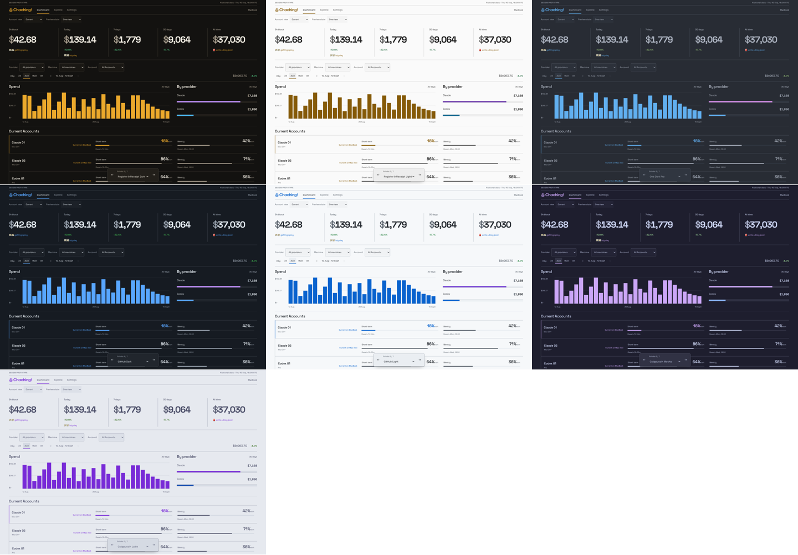

# Palette comparison prototype

Question: which concrete colours should fill the seven Themes' semantic slots?

Run `pnpm prototype` in this worktree, then open http://127.0.0.1:5197/?palette=register-light. The bottom picker and left/right keys change palette. Account view changes the accepted quota layouts; Preview state opens cold scan or session detail. Palette mapping below the dashboard exposes every semantic role, hex value and surface. Explore and Settings retain the accepted fixture prototype's interactions.

This throwaway branch extends dashboard prototype `4c25bdf`, including the typography and motion refinements after the original layout acceptance. All data remains fictional. No production theme preference, storage bootstrap, TUI change or receipt export change is implemented here. The URL carries the prototype palette and reloads it; OS-driven Auto and flash-free startup belong to the implementation spec.

Rai chose neutral white and brass for Register & Receipt Light during this session. Palette acceptance is pending again after the colour revision below.

## Mapping proposals

The revised provider mapping is Claude orange, Codex blue, Pi purple, and Cursor/OpenCode/Unknown gray. Model colours inherit their provider colour; no independent family/hash slots or Haiku-yellow category remain. Use the provider attached to the usage record, not a guess from the model name. Model names and labels distinguish models sharing a colour.

Register & Receipt Light retains neutral surfaces. Amber accent and warm-spend marks are now #b77900; small accent text uses #855a08. Graphical accents clear 3:1 against all fills, while readable text still clears 4.5:1. The old one-colour-for-both mapping made the fills look brown. Claude's Light orange is #a64900 and Pi's purple is #7142ae.

The dashboard subsidisation panel follows the web palette. Exported receipts retain the original fixed-brand token source.

## Upstream sources and adaptations

Starting colours were verified against [One Dark Pro](https://github.com/Binaryify/OneDark-Pro/blob/master/themes/OneDark-Pro.json), [Catppuccin](https://github.com/catppuccin/palette/blob/main/palette.json), and the [GitHub theme mappings](https://github.com/primer/github-vscode-theme/blob/main/src/theme.js) plus [explicit overrides](https://github.com/primer/github-vscode-theme/blob/main/src/colors.js). These are semantic adaptations, not exact editor theme reproductions. Concrete source is `src/lib/brand/prototype-palettes.ts`.

Text and provider/model labels clear 4.5:1 across all four fills. Accent, warm-spend and chrome graphics clear 3:1. The prior universal 4.5 rule was stricter than the accepted architecture contract and has been replaced with role-specific checks. The separate Haiku distance constraint is superseded by provider-coloured models; fixed-brand asset checks remain unchanged.

## Validation

`pnpm exec vitest run src/lib/brand/contrast.test.ts src/lib/components/prototype-data.test.ts`: 78 contrast tests passed after the revision; fixture tests passed in the preceding version. The existing contrast test parameterises all seven palettes, checks role-specific thresholds and provider/model equality. Existing fixed-brand checks still pass.

`pnpm check`: zero errors and warnings. `pnpm build:sk`: passed, with the existing adapter warning about external `node:sqlite`.

Browser checked all seven palettes at 1440×1000 and 390×700, plus 560×560, without horizontal overflow. Checked palette select, keyboard cycling, URL reload, three Account views, cold scan, session detail, Explore search and return to dashboard. Screenshots include the neutral Light desktop and Latte phone. These checks establish a runnable comparison, not production acceptance.

Two inherited Svelte warnings reproduce on the unmodified dashboard prototype at port 5192 as well: NumberFlow hydration mismatch and TanStack proxy equality in the Explore journey. No runtime errors were observed. Mechanical design scan reported existing thick-border and chart size-transition warnings; palette-only work leaves those layout decisions intact.

## Mobile review over Tailscale

Open https://latios.piranha-wyvern.ts.net:5196/?palette=register-light from the tailnet. The HTTPS proxy on port 5196 targets the loopback preview on 5197. Restart with `pnpm prototype`; the separate backend port avoids Vite port probing conflicting with the Tailscale listener. Only the exact Tailscale hostname is added to the dev allowlist. Mobile palette and preview selectors have 44px touch targets, 16px text, and safe-area spacing. Verified via the HTTPS URL at 320px, 390px and 430px without horizontal overflow.

## Warning colour revision

Rai requested yellow warnings in both light and dark modes. `warn` is now #f4ce3a in all seven palettes. Light modes use #665000 warning ink and an outline around the yellow indicator; dark modes use yellow warning ink. The contrast check covers the actual ink/fill pair and the visible outline, rather than darkening yellow into olive.
